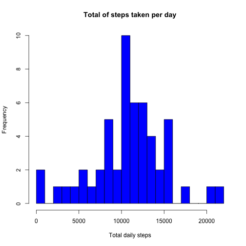

# Reproducible Research: Peer Assessment 1
---
title: "PA_Template1"
output: html_document
---

This is an R Markdown document for the first peer assessment. 

## Loading and preprocessing the data 

 --> Make sure to copy the input file <u><b>activity.csv</b></u> is copied to the working directory


```r
steps <- read.csv("activity.csv")
summary(steps)
```

```
##      steps                date          interval     
##  Min.   :  0.00   2012-10-01:  288   Min.   :   0.0  
##  1st Qu.:  0.00   2012-10-02:  288   1st Qu.: 588.8  
##  Median :  0.00   2012-10-03:  288   Median :1177.5  
##  Mean   : 37.38   2012-10-04:  288   Mean   :1177.5  
##  3rd Qu.: 12.00   2012-10-05:  288   3rd Qu.:1766.2  
##  Max.   :806.00   2012-10-06:  288   Max.   :2355.0  
##  NA's   :2304     (Other)   :15840
```
## PART I: What is mean total number of steps taken per day?

 --> Ignoring the missing values in the dataset. Reading the dataset in a new dataframe
 

```r
steps_2 <- steps[!(steps$steps == "NA"),]
```

### Calculate the total number of steps taken per day
 

```r
#Sum the number of steps for each day first

steps.aggr.date <- aggregate(x=steps_2$steps, by=list(steps_2$date), FUN=sum)
```

### Make a histogram of the total number of steps taken each day

 --> Make a histogram for the steps for each day in the data set
 

```r
hist(steps.aggr.date$x, xlab = "Total daily steps", breaks = 20, main = "Total of steps taken per day", col="blue")
```

 

### Calculate and report the mean and median of the total number of steps taken per day

```r
mean(steps.aggr.date$x)
```

```
## [1] 10766.19
```

```r
median(steps.aggr.date$x)
```

```
## [1] 10765
```

## Part II: What is the average daily activity pattern?

--> Make a new data.frame with the steps aggregated by interval

```r
# Aggregate the number of steps by the interval
steps.aggr.int <- aggregate(x=steps_2$steps, by=list(steps_2$interval), FUN=mean)

# Change the column names of the resulting data frame
colnames(steps.aggr.int) <- c("Interval","Average.Steps")

# View the resulting dataframe 
head(steps.aggr.int, 5)
```

```
##   Interval Average.Steps
## 1        0     1.7169811
## 2        5     0.3396226
## 3       10     0.1320755
## 4       15     0.1509434
## 5       20     0.0754717
```

### Make a time series plot (i.e. type = "l") of the 5-minute interval (x-axis) and the average number of steps taken, averaged across all days (y-axis)

```r
# Plot the chart as a time series
plot(steps.aggr.int$Interval, steps.aggr.int$Average.Steps, type="l", xlab="5 minute interval", ylab="Average steps in each interval")
```

 

### Which 5-minute interval, on average across all the days in the dataset, contains the maximum number of steps?

```r
steps.aggr.int[which.max(steps.aggr.int$Average.Steps),]
```

```
##     Interval Average.Steps
## 104      835      206.1698
```

## Part III: Imputing missing values
Note that there are a number of days/intervals where there are missing values (coded as NA). The presence of missing days may introduce bias into some calculations or summaries of the data.

### Calculate and report the total number of missing values in the dataset (i.e. the total number of rows with NAs)


```r
nrow(steps[is.na(steps$steps),])
```

```
## [1] 2304
```

### Devise a strategy for filling in all of the missing values in the dataset. The strategy does not need to be sophisticated. For example, you could use the mean/median for that day, or the mean for that 5-minute interval, etc.

```r
# I will use the average of the interval and replace any NA value in that interval
```

### Create a new dataset that is equal to the original dataset but with the missing data filled in.

```r
# Merge the original dataset with the dataset with the averages
steps.merged <- merge(steps, steps.aggr.int, by.x="interval", by.y="Interval")

# Update the NA value with the corresponding average of the interval
steps.merged$steps[is.na(steps.merged$steps)] <- as.integer(round(steps.merged$Average.Steps[is.na(steps.merged$steps)]))

# Aggregate the number of steps by the days
steps.merged.date <- aggregate(x=steps.merged$steps, by=list(steps.merged$date), FUN=sum)

# Changing the column names
colnames(steps.merged.date) <- c("Date","Total.Steps")

# Quick view of the resulting data.frame
head(steps.merged.date,5)
```

```
##         Date Total.Steps
## 1 2012-10-01       10762
## 2 2012-10-02         126
## 3 2012-10-03       11352
## 4 2012-10-04       12116
## 5 2012-10-05       13294
```

### Make a histogram of the total number of steps taken each day and Calculate and report the mean and median total number of steps taken per day.


```r
hist(steps.merged.date$Total.Steps, xlab = "Total daily steps", breaks = 20, main = "Total of steps taken per day", col="blue")
```

 

```r
# Calculate the mean and median
mean(steps.merged.date$Total.Steps)
```

```
## [1] 10765.64
```

```r
median(steps.merged.date$Total.Steps)
```

```
## [1] 10762
```

### Do these values differ from the estimates from the first part of the assignment? What is the impact of imputing missing data on the estimates of the total daily number of steps?

The values differ but the difference is not much.

```r
# Difference of mean value of the total number of steps = (10766.19 - 10765.64) = 0.65
# Difference of median value of the total number of steps = ( 10765 - 10762) = 3
```
So the difference is not significant.

## PART IV: Are there differences in activity patterns between weekdays and weekends?

### Create a new factor variable in the dataset with two levels – “weekday” and “weekend” indicating whether a given date is a weekday or weekend day.


```r
# Make a copy of the data.frame created in the earlier step

steps.merged.2 <- steps.merged
# Add a new column determining the type of day 

steps.merged.2$day.type <- ifelse(weekdays(as.Date(steps.merged.2$date)) %in% c("Saturday", "Sunday"), "weekend", "weekday")
# Create a new data frame computing the average of steps by interval and the weekday type
steps.merged.2.int <- aggregate(x=steps.merged.2$steps, by=list(steps.merged.2$interval,steps.merged.2$day.type), FUN=mean)
# Update data.frame column names
colnames(steps.merged.2.int) <- c("interval","day.type","average.steps")

# Quick view of the resulting data.frame
head(steps.merged.2.int, 5)
```

```
##   interval day.type average.steps
## 1        0  weekday    2.28888889
## 2        5  weekday    0.40000000
## 3       10  weekday    0.15555556
## 4       15  weekday    0.17777778
## 5       20  weekday    0.08888889
```

### Make a panel plot containing a time series plot (i.e. type = "l") of the 5-minute interval (x-axis) and the average number of steps taken, averaged across all weekday days or weekend days (y-axis).

--> Using the ggplot library to plot the chart. This can be done using other methods as well.


```r
# Making sure the ggplot2 library is loaded
library(ggplot2)

ggplot(steps.merged.2.int, aes(interval, average.steps)) + geom_line() + xlab("Time of day") + ylab("Mean number of steps") + facet_grid(. ~ day.type)
```

 
